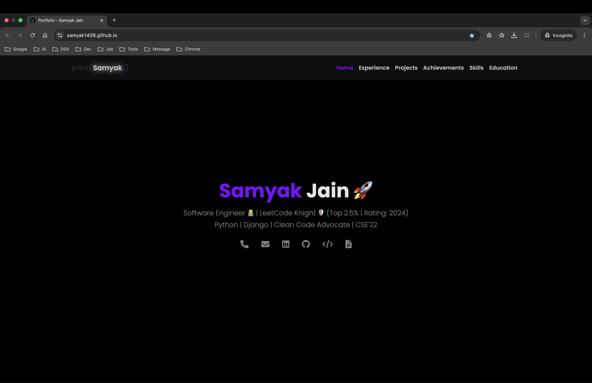

# Portfolio

This repository hosts the source code for my personal portfolio website.
It is built with a focus on **minimalistic design**, **dark theme**, and **responsiveness**.

## Live Site

**Visit the live site here:** [samyak1409.github.io](https://samyak1409.github.io)

## Screenshot

## Tech Stack

**Frontend**
- HTML5
- CSS3
- Bootstrap
- JavaScript

**Deployment**
- GitHub Pages

## External UX Improvements

- **Webhook for waking up deployed projects:**

  Added a [webhook](https://en.wikipedia.org/wiki/Webhook) using JS, which sends wake-up calls to my deployed projects, e.g. [django-blog.koyeb.app/wake-up](https://django-blog.koyeb.app/wake-up), so that whenever someone visits the portfolio, my projects wake up automatically in the background, anticipating that they might visit the projects next.

- **[/django-blog](https://samyak1409.github.io/django-blog):**

  Added this endpoint which [redirects](https://en.wikipedia.org/wiki/URL_redirection) to the actual deployment [django-blog.koyeb.app](https://django-blog.koyeb.app), and displays a customized "please wait" message to let the viewer know that this waiting is expected, instead of a blank loading screen if a user goes directly to [django-blog.koyeb.app](https://django-blog.koyeb.app), which could've led recruiters to leave the site. Linked [samyak1409.github.io/django-blog](https://samyak1409.github.io/django-blog) everywhere instead of [django-blog.koyeb.app](https://django-blog.koyeb.app).

- **[/phone](https://samyak1409.github.io/phone):**

  Added this [redirect](https://en.wikipedia.org/wiki/URL_redirection) endpoint for use on my GitHub profile README [github.com/samyak1409](https://github.com/samyak1409), since GitHub READMEs don’t render `tel:` protocol links as clickable.
